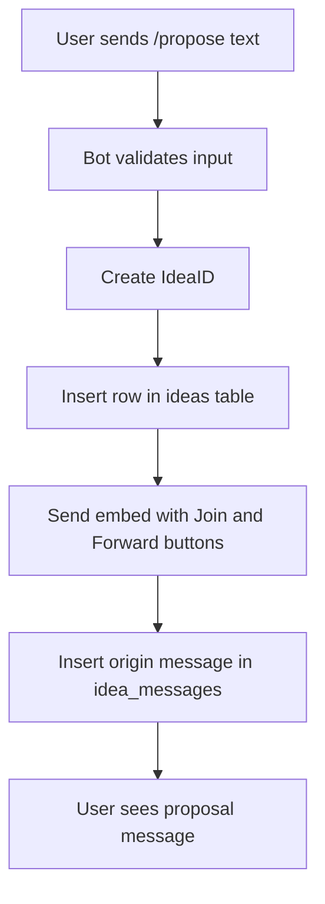
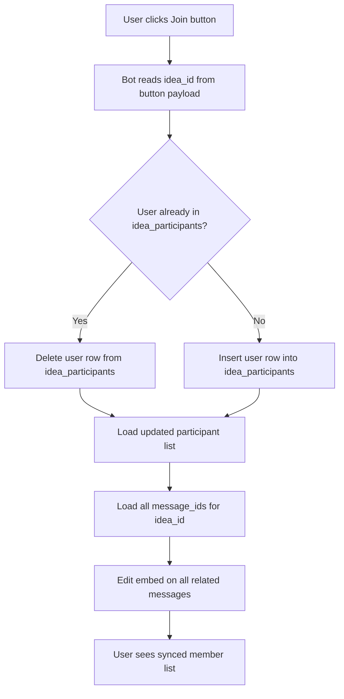
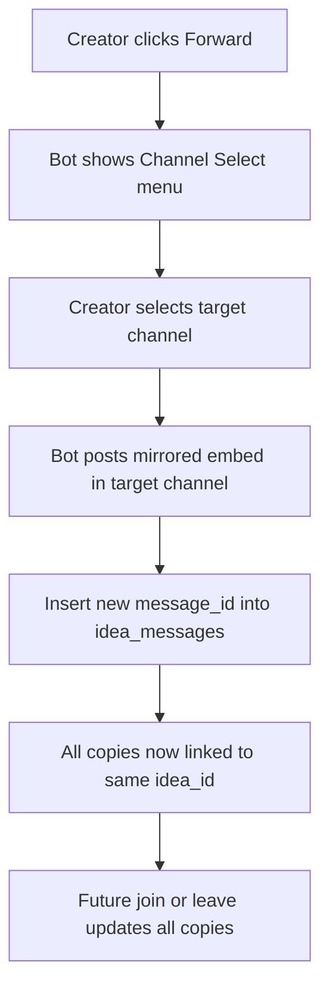
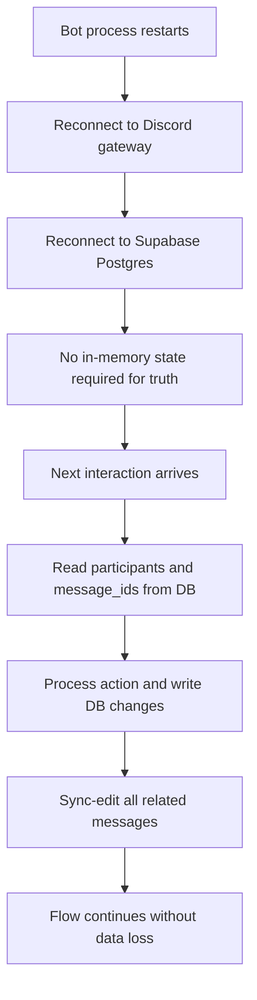
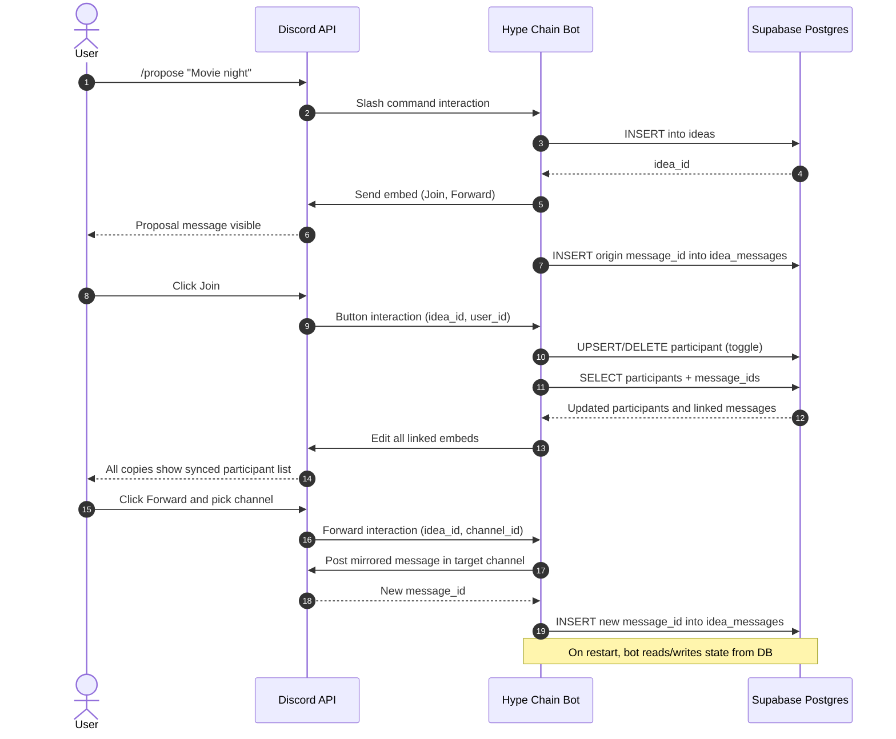
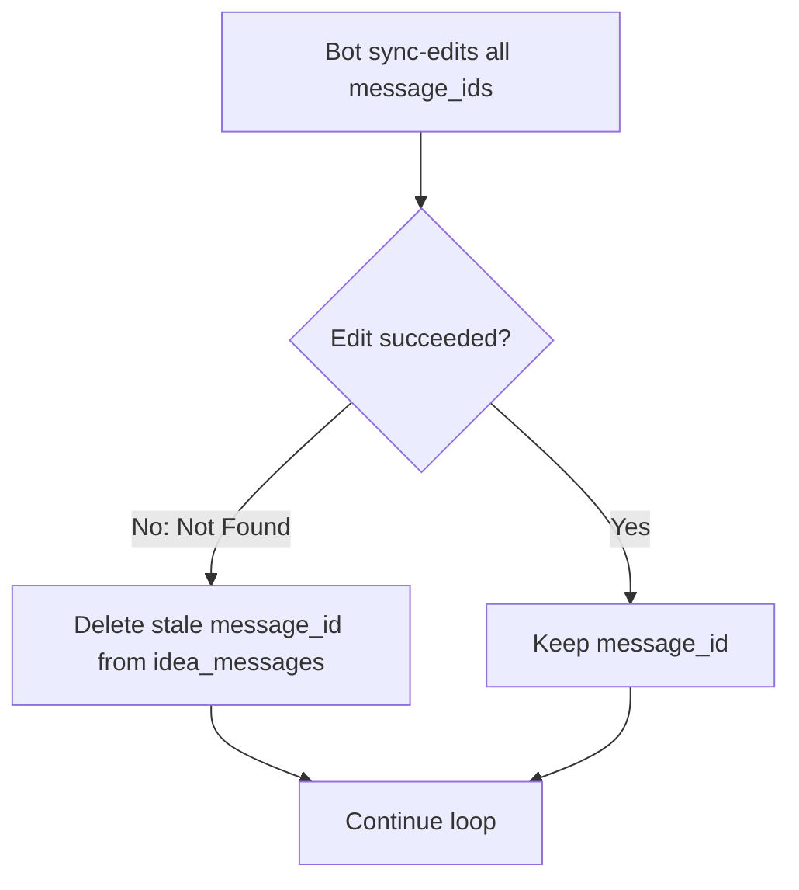
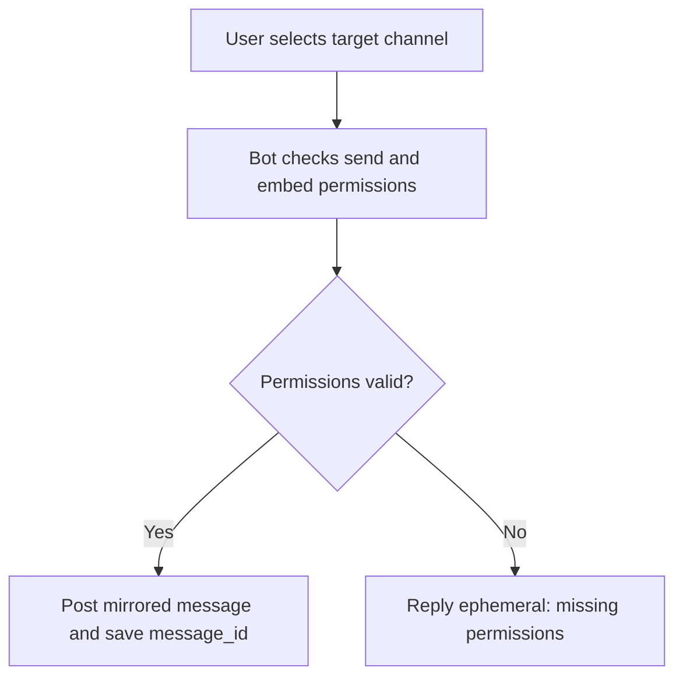
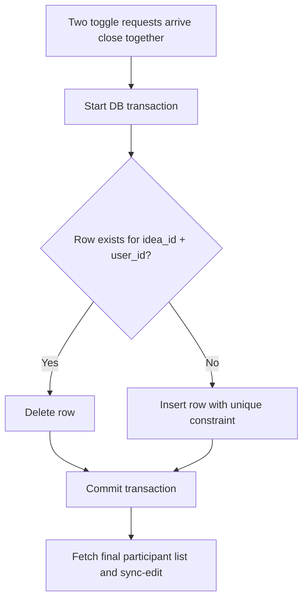
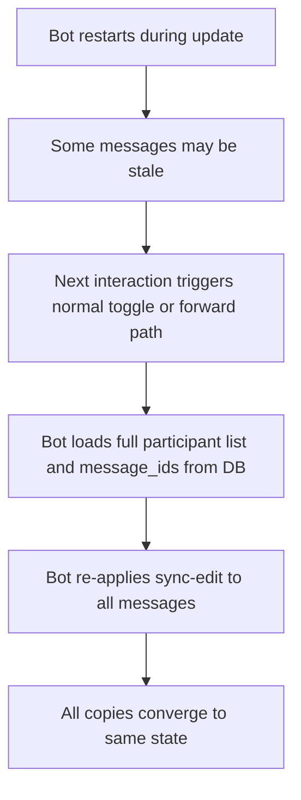

# Project Plan: The Hype Chain (Discord Mini App)

## 1. Overview
A social coordination tool for Discord. Users propose ideas, others join/leave via a toggle button. The proposal can be "Forwarded" to other channels while staying synchronized.

## 2. Core Features
- Command: /propose [text]
- UI: Rich Embed with a 'Join' button.
- Logic: Toggle Join (If user is on list, remove them. If not, add them).
- Sync: If forwarded, all versions of the message update at once.

## 3. Technical Logic
- Store IdeaID, CreatorID, and an Array of ParticipantIDs.
- Use discord.js Message Components (Buttons).
- Keep a list of MessageIDs for each IdeaID to handle the sync-edit.
- Persist all idea state in a database so restarts do not lose participant/message sync data.

## 3.1 Free Database Solution (Recommended)
- Use Supabase Postgres (free tier) as the persistent store.
- Why: free, managed Postgres, good Node.js support, easy local-to-cloud path.
- Store:
	- `ideas` table: `idea_id`, `creator_id`, `text`, `created_at`
	- `idea_participants` table: `idea_id`, `user_id` (unique pair for toggle)
	- `idea_messages` table: `idea_id`, `guild_id`, `channel_id`, `message_id`
- Result: bot restarts are safe because state is reloaded from Postgres.

## 4. Implementation Steps
1. Setup discord.js client and slash command handling.
2. Create the /propose command to send the initial Embed.
3. Connect Supabase Postgres and create the 3 tables.
4. Handle 'interactionCreate' for the Button click (Toggle logic + DB write).
5. Implement the 'Forward' button with a Channel Select menu.
6. On each update, fetch related message IDs from DB and sync-edit all forwarded messages.

## 5. Main User Case Flow Diagrams

### UC1: Create Proposal (/propose)


### UC2: Join or Leave Proposal (Toggle)


### UC3: Forward Proposal to Another Channel


### UC4: Bot Restart and Recovery


### UC5: End-to-End Sequence (User, Discord, Bot, DB)


## 6. Edge Cases

### EC1: A Forwarded Message Was Deleted
- Problem: `idea_messages` still contains a `message_id` that no longer exists.
- Handling: when sync-edit fails with Not Found, remove that `message_id` from DB and continue updating the rest.



### EC2: Missing Permission in Target Channel
- Problem: bot cannot send or edit messages in selected channel.
- Handling: reject forward action for that channel and send an ephemeral error to the user.



### EC3: Double Click or Concurrent Joins
- Problem: two join/leave actions can overlap and cause inconsistent participant state.
- Handling: enforce DB uniqueness on `(idea_id, user_id)` and use transaction-safe toggle logic.



### EC4: Bot Restarts Mid-Update
- Problem: process stops while editing some forwarded messages.
- Handling: on next interaction, derive state from DB and re-run sync across all current `message_id` rows.



## 7. DB Schema (SQL)

Use this in Supabase SQL Editor.

```sql
-- 1) Ideas
create table if not exists public.ideas (
	idea_id uuid primary key default gen_random_uuid(),
	creator_id text not null,
	text text not null,
	created_at timestamptz not null default now()
);

-- 2) Participants (toggle join/leave)
create table if not exists public.idea_participants (
	idea_id uuid not null references public.ideas(idea_id) on delete cascade,
	user_id text not null,
	joined_at timestamptz not null default now(),
	primary key (idea_id, user_id)
);

-- 3) Message links (origin + forwarded copies)
create table if not exists public.idea_messages (
	idea_id uuid not null references public.ideas(idea_id) on delete cascade,
	guild_id text not null,
	channel_id text not null,
	message_id text not null,
	created_at timestamptz not null default now(),
	primary key (idea_id, message_id)
);

-- Optional safety: same Discord message should not map to multiple ideas.
create unique index if not exists ux_idea_messages_global_message
	on public.idea_messages (guild_id, channel_id, message_id);

-- Query performance indexes
create index if not exists ix_participants_idea
	on public.idea_participants (idea_id);

create index if not exists ix_messages_idea
	on public.idea_messages (idea_id);
```

### 7.1 Toggle Pattern (Transaction-Safe)

```sql
-- Pseudocode transaction logic (run from bot):
-- begin;
--   if exists(select 1 from idea_participants where idea_id = $1 and user_id = $2)
--     delete from idea_participants where idea_id = $1 and user_id = $2;
--   else
--     insert into idea_participants (idea_id, user_id) values ($1, $2)
--     on conflict (idea_id, user_id) do nothing;
-- commit;
```

## 8. Minimal Supabase + discord.js Snippets

### 8.1 Environment Variables

```bash
DISCORD_TOKEN=your_discord_bot_token
DISCORD_CLIENT_ID=your_discord_app_client_id
SUPABASE_URL=https://your-project-ref.supabase.co
SUPABASE_SERVICE_ROLE_KEY=your_service_role_key
```

### 8.2 Supabase Client Setup

```js
import { createClient } from '@supabase/supabase-js';

export const supabase = createClient(
	process.env.SUPABASE_URL,
	process.env.SUPABASE_SERVICE_ROLE_KEY,
	{ auth: { persistSession: false } }
);
```

### 8.3 Create Proposal (/propose)

```js
import { ActionRowBuilder, ButtonBuilder, ButtonStyle, EmbedBuilder } from 'discord.js';
import { supabase } from './supabase.js';

export async function handlePropose(interaction) {
	const text = interaction.options.getString('text', true).trim();

	const { data: idea, error } = await supabase
		.from('ideas')
		.insert({ creator_id: interaction.user.id, text })
		.select('idea_id, text')
		.single();

	if (error) throw error;

	const embed = new EmbedBuilder()
		.setTitle('Hype Chain Proposal')
		.setDescription(idea.text)
		.addFields({ name: 'Participants', value: 'No one yet' });

	const row = new ActionRowBuilder().addComponents(
		new ButtonBuilder()
			.setCustomId(`join:${idea.idea_id}`)
			.setLabel('Join')
			.setStyle(ButtonStyle.Success),
		new ButtonBuilder()
			.setCustomId(`forward:${idea.idea_id}`)
			.setLabel('Forward')
			.setStyle(ButtonStyle.Primary)
	);

	await interaction.reply({ embeds: [embed], components: [row] });
	const message = await interaction.fetchReply();

	await supabase.from('idea_messages').insert({
		idea_id: idea.idea_id,
		guild_id: interaction.guildId,
		channel_id: interaction.channelId,
		message_id: message.id
	});
}
```

### 8.4 Toggle Join/Leave and Sync

```js
import { EmbedBuilder } from 'discord.js';
import { supabase } from './supabase.js';

function parseCustomId(customId) {
	const [action, ideaId] = customId.split(':');
	return { action, ideaId };
}

export async function handleJoinToggle(interaction) {
	const { ideaId } = parseCustomId(interaction.customId);
	const userId = interaction.user.id;

	const { data: existing } = await supabase
		.from('idea_participants')
		.select('idea_id')
		.eq('idea_id', ideaId)
		.eq('user_id', userId)
		.maybeSingle();

	if (existing) {
		await supabase
			.from('idea_participants')
			.delete()
			.eq('idea_id', ideaId)
			.eq('user_id', userId);
	} else {
		await supabase
			.from('idea_participants')
			.insert({ idea_id: ideaId, user_id: userId });
	}

	await syncAllMessagesForIdea(interaction.client, ideaId);
	await interaction.deferUpdate();
}

export async function syncAllMessagesForIdea(client, ideaId) {
	const [{ data: participants }, { data: links }, { data: idea }] = await Promise.all([
		supabase.from('idea_participants').select('user_id').eq('idea_id', ideaId),
		supabase.from('idea_messages').select('channel_id, message_id').eq('idea_id', ideaId),
		supabase.from('ideas').select('text').eq('idea_id', ideaId).single()
	]);

	const participantText = participants?.length
		? participants.map((p) => `<@${p.user_id}>`).join('\n')
		: 'No one yet';

	const embed = new EmbedBuilder()
		.setTitle('Hype Chain Proposal')
		.setDescription(idea.text)
		.addFields({ name: 'Participants', value: participantText });

	for (const link of links ?? []) {
		try {
			const channel = await client.channels.fetch(link.channel_id);
			const message = await channel.messages.fetch(link.message_id);
			await message.edit({ embeds: [embed] });
		} catch (err) {
			// Not Found or missing access: remove stale mapping and continue.
			await supabase
				.from('idea_messages')
				.delete()
				.eq('idea_id', ideaId)
				.eq('message_id', link.message_id);
		}
	}
}
```

### 8.5 Forward Handler (Skeleton)

```js
import { ChannelType } from 'discord.js';
import { supabase } from './supabase.js';
import { syncAllMessagesForIdea } from './toggle.js';

export async function handleForward(interaction, ideaId, targetChannelId) {
	const channel = await interaction.guild.channels.fetch(targetChannelId);
	if (!channel || channel.type !== ChannelType.GuildText) {
		return interaction.reply({ content: 'Invalid target channel.', ephemeral: true });
	}

	const perms = channel.permissionsFor(interaction.guild.members.me);
	if (!perms?.has(['SendMessages', 'EmbedLinks', 'ViewChannel'])) {
		return interaction.reply({ content: 'I lack permission in that channel.', ephemeral: true });
	}

	// Post first, then run sync so the new copy has the latest participant list.
	const posted = await channel.send({ content: 'Synced Hype Chain proposal' });

	await supabase.from('idea_messages').insert({
		idea_id: ideaId,
		guild_id: interaction.guildId,
		channel_id: channel.id,
		message_id: posted.id
	});

	await syncAllMessagesForIdea(interaction.client, ideaId);
	return interaction.reply({ content: 'Forwarded and synced.', ephemeral: true });
}
```